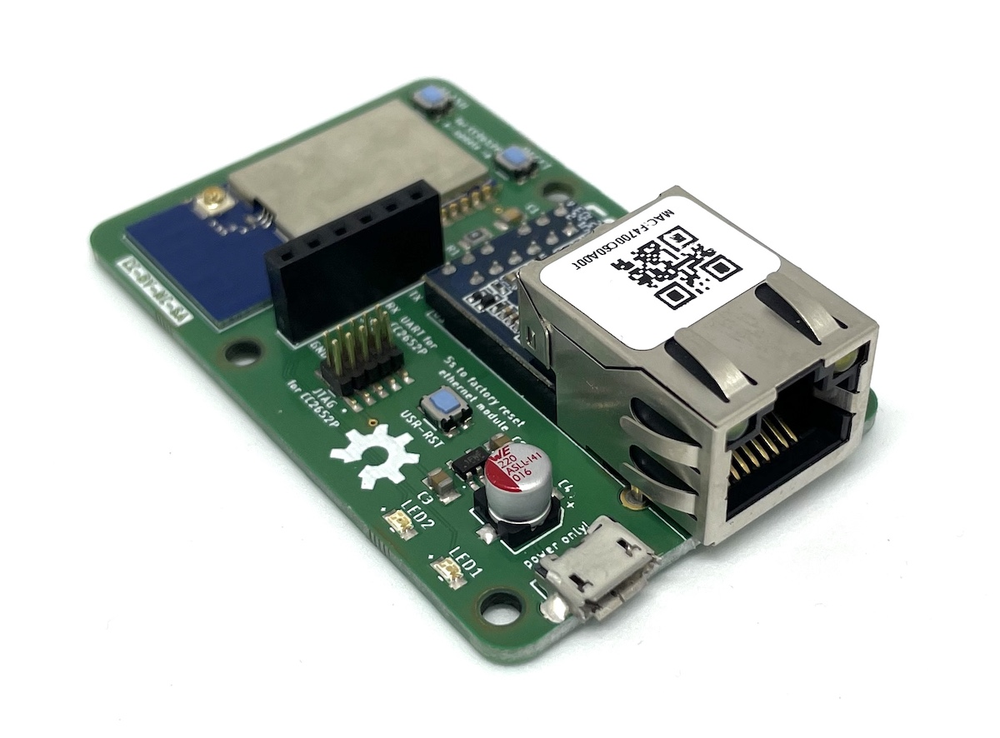
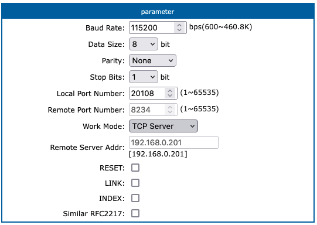

# cod.m ZigBee CC2652P2 TCP Coordinator
Initiated by Matthias' video to build a [ZigBee Coordinator with Ethernet connectivity](https://www.youtube.com/watch?v=Uz26JzOJVTc) we developed a small PCB to integrate everything in a small form factor - ready to go if you like.

The coordinator uses an CC2652P2 together with an USR-K6 serial ethernet gateway. The CC2652P2 is the current ZigBee implementation from Texas Intruments and supports ZigBee 3.x. The Z-Stack firmware is actively developed - much thanks to @koenkk again.

Should be usable with any Home Automation System that let's you use a TCP port instead of a local port. The module is tested with [io.broker](https://www.iobroker.net/) and [zigbee2mqtt](https://www.zigbee2mqtt.io/).

You can buy it at our webshop: https://shop.codm.de/automation/zigbee/40/zigbee-cc2652p2-tcp-ethernet-coordinator. It comes preconfigured with DHCP enabled, case and antenna.



To build a serial bridge the USR-K6 from USR IOT comes into play which implements everything needed to act as an TCP Server with a webinterface and in a small form factor.

You can find the files to 3d print the case on printables:
https://www.printables.com/de/model/179517-codm-cc2652p2-tcp-zigbee-coordiantor-case

## Configuration
If your home automation system let's you configure `TI ZStack/CCxxxx` devices as ZigBee coordinator over a TCP connection, you should be good to go. 

### io.broker
Install the zigbee adapter and configure the portname to `tcp://<ip-of-cc2652p-tcp>:20108` and choose `TI ZStack/CCxxxx` under type. After restarting the adapter everything should work. Check the logs for details like

```
Coordinator firmware version: {"type":"zStack3x0","meta":{"transportrev":2,"product":1,"majorrel":2,"mino rrel":7,"maintrel":1,"revision":20220103}}
```

### zigbee2mqtt
In `data/configuration.yaml` use the tcp connection under port in the section serial like so (including single quotes): 
```
serial: 
  port: 'tcp://<ip-of-cc2652p-tcp>:20108'
```

### USR-K6
If you factory reset the USR-K6 you'll need to configure the serial bridge again (see image). It act's as a TCP-Server on the given port.

The default IP of the USR-K6 is `192.168.0.7` and username/password for the webinterface is `admin/admin`.



## Update
To update the CC2652P2 module on the PCB you'll need an USB-UART adapter with the common FTDI pinout. Make sure it is 3.3V adaptro as 5V _will_ damage the module.

Plug it on the corresponding header on the PCB and bring the CC2652P2 in bootloader mode by holding FLASH, pressing RESET and then release FLASH.
Afterwards it is the same as "any normal" serial connected zigbee module. See https://github.com/codm/cc2652-raspberry-pi-module#serial-via-gpio

After that powercycle the module and use again.

Flashing via JTAG is also possible through the corresponding header.

# Thanks
* @klein0r Inital Idea - https://haus-automatisierung.com/
* @koenkk Z-Stack Firmware - https://github.com/Koenkk/Z-Stack-firmware


# License
[CC-BY-NC-SA 4.0](https://creativecommons.org/licenses/by-nc-sa/4.0/)

cod.m GmbH, Patrik Mayer, 2022